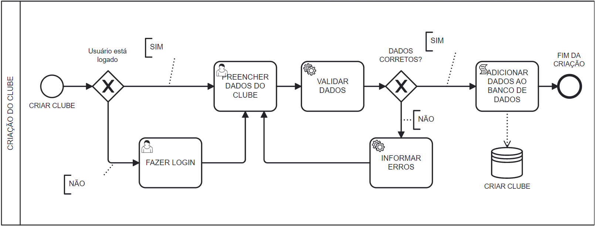
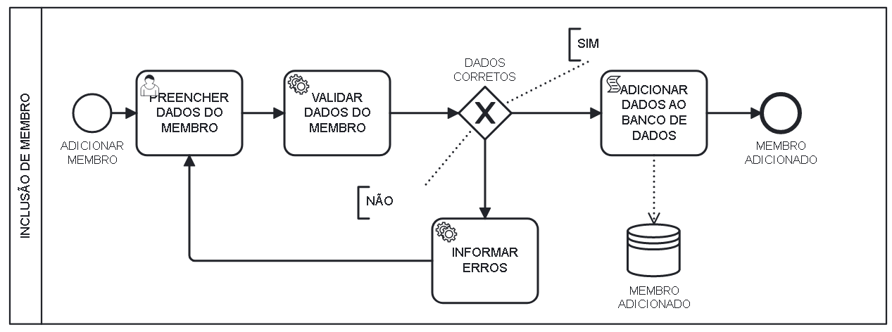
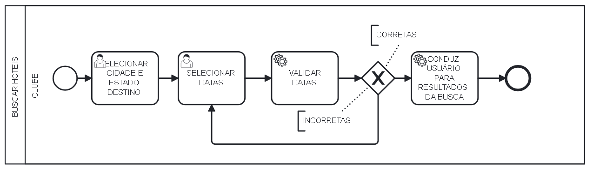
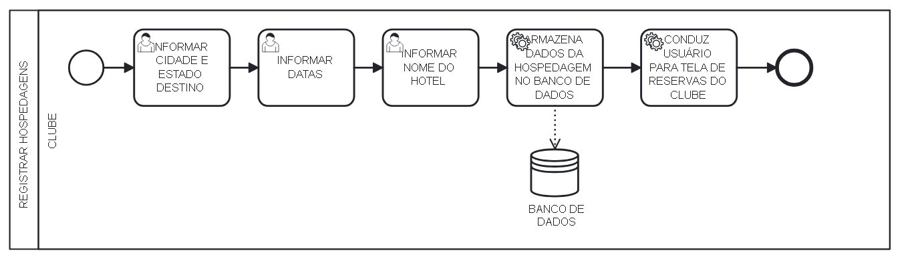
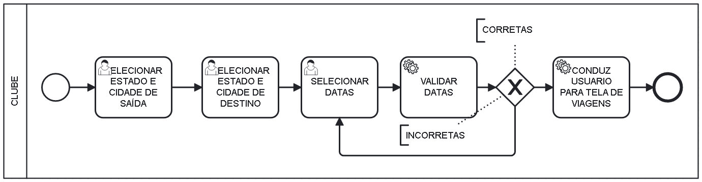
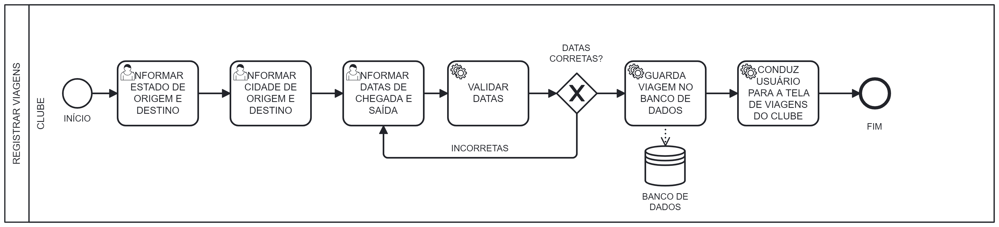
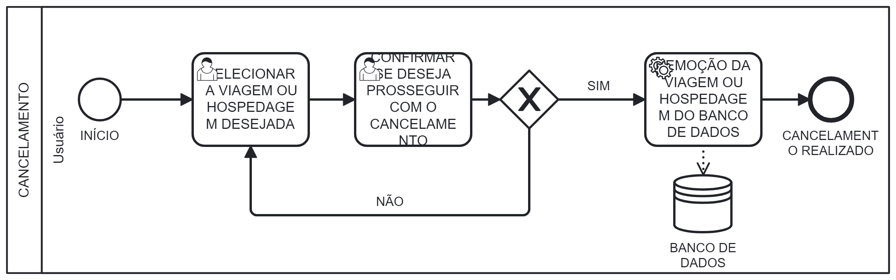

# marcoL4

---

**Bruno Rocha Corrêa Urbano, bruno.urbano.rocha@gmail.com**

**Pedro de Barros Alves, pedro.de.barros.alves@gmail.com**

**Thiago Vitor Pereira Perdigão, thiagovitor299@gmail.com**

**Renato Ramalho Teodoro, renatojr9910@gmail.com**

**Bernardo Oliveira Pires, Bernardoopires14@gmail.com**

---

Professores:

**Eveline Alonso Veloso**

**Hugo Bastos de Paula**

---

_Curso de Engenharia de Software, Unidade Praça da Liberdade_

_Instituto de Informática e Ciências Exatas – Pontifícia Universidade de Minas Gerais (PUC MINAS), Belo Horizonte – MG – Brasil_

---

**Resumo**. 
O projeto tem como principal objetivo fornecer uma ferramenta de fácil acesso capaz de auxiliar clubes/times de futebol na gestão de suas logísticas.

---

## SUMÁRIO

1. [Introdução](#introducao "Introdução")  
	1.1. [Contextualização](#contextualizacao "Contextualização")  
	1.2. [Problema](#problema "Problema")  
	1.3. [Objetivos do Trabalho](#objetivos "Objetivos")  
 	-> 1.3.1. [Objetivo Geral](#objetivo-geral "Objetivo Geral")   
 	-> 1.3.2. [Objetivos Especificos](#objetivo-especificos "Objetivo Específicos")  
 	1.4. [Justificativa](#justificativa "Justificativa")  

2. [Participantes do Processo](#participantes_processo "Participantes do Processo")  

3. [Modelagem do processo de negócio](#modelagem_processo "Modelagem do processo de negócio")  
	3.1. [Análise da Situação Atual](#analise-situacao-atual "Análise da Situação Atual")  
	3.2. [Descrição Geral da Proposta](#descricaco-geral-proposta "Descrição Geral da Proposta")  
	3.3. [Modelagem dos Processos](#modelagem-processos "Modelagem dos Processos")  
   		-> 3.3.1 [Processo 1 – Criação de Clubes](#processo1 "Processo 1")  
	 	-> 3.3.2 [Processo 2 – Inclusão de Membro](#processo2 "Processo 2")  
	   	-> 3.3.3 [Processo 3 – Buscar Hotéis](#processo3 "Processo 3")  
	   	-> 3.3.4 [Processo 4 – Registrar Hotéis](#processo4 "Processo 4")  
	   	-> 3.3.5 [Processo 5 – Buscar Viagens](#processo5 "Processo 5")  
	   	-> 3.3.6 [Processo 6 – Registrar Viagens](#processo6 "Processo 6")  
   		-> 3.3.7 [Processo 7 – Cancelamento](#processo7 "Processo 7")  
4. [Projeto da Solução](#projeto-da-solucao "Projeto da Solução")  
   	4.1. [Detalhamento das atividades](#detalhamento-atividades "Detalhamento das Atividades")  
   	4.2. [Tecnologias](#tecnologias "Tecnologias")  
5. [Modelo de dados](#modelo-de-dados "Modelo de Dados")  
6. [Indicadores de desempenho](#indicadores-de-desempenho "Indicadores de Desempenho")  
7. [Sistema desenvolvido](#sistema-desenvolvido "Sistema Desenvolvido")  
---

# 1. Introdução

## 1.1. Contextualização

O futebol é, além de um esporte, um mercado que movimenta bilhões de reais. Foi observado que recentemente clubes brasileiros sofreram problemas relacionados à logística. Tais problemas podem causar acidentes, como o acidente aéreo da Chapecoense, em 2016, causado pelo fato que aeronave da Lamia decolou sem a quantidade mínima de combustível exigida; além disso havia falhas no plano de voo e inexistia seguro para voar em território colombiano. Outro exemplo aconteceu em 2018, quando o Cruzeiro sofreu com problemas com o ônibus fretado para um jogo e foi obrigado a utilizar transporte público para chegar a uma cidade. Esse ano a presidente vigente do Palmeiras Leila Pereira adquiriu um avião para o clube, a fim de otimizar suas viagens, o assunto também foi comentado entre os clubes gaúchos, Grêmio e Internacional.

## 1.2. Problema

Considerando esse cenário, a aplicação proposta neste trabalho almeja solucionar três principais problemas. O primeiro refere-se aos altos custos que uma operação de viagem pode ter. Já o segundo problema, envolve a inexistência de uma plataforma que possua integração de todas as etapas de um processo como esse, sendo elas: viagem aérea, hospedagem e fretamento. O terceiro está atrelado a imprevistos, muitas vezes causados por empresas despreparadas ou pequenas, que não podem arcar com o tamanho da operação.

## 1.3. Objetivos do Trabalho

1.3.1. Objetivo Geral

O projeto tem como principal objetivo fornecer uma ferramenta de fácil acesso capaz de auxiliar clubes/times de futebol na gestão da logística.

1.3.2. Objetivos Específicos

1 - Auxiliar os clubes de futebol com toda a operação de uma viagem.

2 - Realizar fretamentos de ônibus junto às empresas parceiras.

3 - Realizar fretamentos aéreos/compra de passagens junto às empresas parceiras.

4 - Realizar hospedagens junto aos Hotéis parceiros.

## 1.4. Justificativa

Com a criação de uma plataforma intuitiva, o projeto tem a finalidade de automatizar os processos atrelados a uma operação de viagem para clubes de futebol, realizando a gerência de data e disponibilidade. Dessa forma, otimiza-se o tempo de execução de tarefas, os custos e a acessibilidade.

---

# 2. Participantes do Processo
- Times/Clubes/Sociedades Anônimas do Futebol (SAFs).
- Empresas de fretamento de transporte aéreo e terrestre.
- Hotéis.

---

# 3. Modelagem do Processo de Negócio

## 3.1. Análise da Situação Atual

A logística é um processo muito complexo com origens ligadas às guerras. Entende-se como logística o deslocamento preciso e conjunto de uma massa para determinados fins, sejam eles esportivos ou não. No caso de times de futebol, além do transporte dos próprios atletas, os times devem atentar-se também ao deslocamento de médicos, fisioterapeutas, materiais de treino, kits para o jogo, objetos pessoais dos atletas e equipe técnica. 

Atualmente, a logística desportiva para clubes de futebol, é comumente subdividida em 3 principais atividades:

- Gestão de Stock: gestão dos equipamentos de treino e todos os materiais necessários para desenvolver as atividades de treino e jogo;
- Gestão do transporte: insere os atletas e os materiais da equipe no local adequado, em treinos ou partidas oficiais;
- Gestão de informação: processamento, transmissão e aquisição da informação dentro dos departamentos responsáveis.

A logística de transporte dos times de futebol brasileiros pode variar de acordo com a situação financeira e a organização de cada clube. Em geral, os times de maior porte costumam contar com uma estrutura mais profissionalizada e recursos mais abundantes, o que possibilita uma logística mais eficiente.

Os clubes futebolísticos quando se preparam para uma viagem devem realizar dois processos: viagem e hospedagem. Os clubes devem escolher, a depender do local do jogo, entre viagem terrestre no qual os clubes entram em contato com companhias de fretamento para alugar, na maioria dos casos, ônibus e vans para realizar as viagens; ou viagem aéreas, no qual os clubes compram passagens de um voo para os atletas e outros membros ou entram em contato com companhias aéreas para alugar um avião que leve um time inteiro. Além disso, os times, juntamente com a organização da viagem, devem realizar a hospedagem do time em local apropriado. Este muitas das vezes é feito em parceria com hotéis conhecidos que já hospedaram tal time anteriormente, porém podem acontecer com outros hotéis caso os hotéis parceiros não tenham vagas disponíveis. 

Porém, é importante pontuar que ainda há muitos times que enfrentam dificuldades em relação ao transporte para os jogos, especialmente quando se trata de competições que envolvem viagens mais longas. Isso pode ocorrer devido à falta de recursos financeiros, problemas na gestão do clube ou mesmo a condições precárias de infraestrutura.

## 3.2. Descrição Geral da Proposta

O processo em que a plataforma atua se inicia quando há um jogo marcado. Previamente essa data será disponibilizada em nosso sistema, porém caso haja necessidade, será possível que o usuário a indique. Após ter uma data definida o sistema irá oferecer opções de reserva de quartos de hotéis e transporte, seja ele terrestre ou aéreo. Em seguida deve-se confirmar a escolha.

Dessa maneira, deve ser feita a reserva mediante o envio dos documentos requisitados pelas empresas. Então será recebida uma confirmação, caso não haja nenhuma pendência, ou uma correção será requerida. Em caso de desistência, o clube deve fazer um pedido ao sistema e, após análise, receberá uma notificação de confirmação.

Nesse viés, vale ressaltar que a atuação da plataforma MARCOL4 se dá pela reserva e contato contínuo entre as partes. Com isso, há maior organização e agilidade no que tange o processo
logístico.

Por fim, é importante manter as limitações do sistema em mente. Ainda nesse contexto, é possível que não haja disponibilidade de reserva, tanto em relação aos hotéis quanto às empresas de transporte. 

## 3.3. Modelagem dos Processos

## 3.3.1 Processo 1 – CRIAÇÃO DE CLUBES

Processo responsável pela criação de um determinado clube de futebol no banco de dados. Para ser iniciado o usuário deverá estar logado. Após efetuar o login, o usuário deverá preencher os dados do clube em questão, que serão validados pelo sistema. Caso os dados estejam incorretos, o sistema informará o usuário, que deverá preencher novamente os campos requisitados. Após essa verificação os dados serão adicionados à nossa base de dados.

## 3.3.2 Processo 2 – INCLUSÃO DE MEMBRO

Processo responsável inclusão de um membro no clube. Para ser iniciado o usuário deverá estar logado e estar vinculado à um clube. O usuário deverá preencher os dados do membro em questão, que serão validados pelo sistema. Caso os dados estejam incorretos, o sistema informará o usuário, que deverá preencher novamente os campos requisitados. Após essa verificação os dados serão adicionados à nossa base de dados.

## 3.3.3 Processo 3 – BUSCAR HÓTEIS

Processo responsável pela busca de hóteis. Primeiramente, o clube deverá selecionar a cidade e estado destino, que são previamente fornecidos pelo site. Após selecionar o destino, o clube deverá escolher as datas de chegada e de partida de sua permanência no hotel. Após isso haverá uma validação feita por parte do sistema, se estiver tudo certo, ao clicar no botão o usuário será redirecionado aos resultados da busca.

## 3.3.4 Processo 4 – REGISTRAR HÓTEIS

Processo responsável pelo registro de sua hospedagem. Primeiramente, o clube deverá selecionar a cidade e estado destino, que são previamente fornecidos pelo site. Em seguida, o usuário deverá informar as datas de chegada e de saída. O sistema irá realizar a checagem das datas, e caso elas estejam incorretas, o usuário deverá informa-lás novamente. Caso as datas estiverem corretas, o usuário deverá informar o nome do hotel em que realizou a reserva. Após isso, o usuário deverá clicar no botão de registro e assim o sistema armazenará as informações dentro do banco de dados e em seguida conduzir o usuário para a tela de viagens já registradas do clube.

## 3.3.5 Processo 5 – BUSCAR VIAGENS

Processo responsável pela busca de viagens (Terrestre ou Aérea). Primeiramente, o clube deverá selecionar o local de partida, local de destino, data de partida e destino. Após isso haverá uma validação feita por parte do sistema, se estiver tudo certo, ao clicar no botão o usuário será redirecionado à tela de viagens.

## 3.3.6 Processo 6 – REGISTRAR VIAGENS

Processo responsável pelo registro de viagens aéreas e terrestres dentro do banco de dados. Primeiramente, o usuário deverá informar o estado de origem e o de destino. Após isso, deverá também informar as cidades de destino e origem. Em seguida, o usuário deverá informar as datas de chegada e de saída. O sistema irá realizar a checagem das datas, e caso elas estejam incorretas, o usuário deverá informa-lás novamente. Caso as datas estiverem corretas, o sistema armazenará as informações dentro do banco de dados e em seguida conduzir o usuário para a tela de viagens já registradas do clube.

## 3.3.7 Processo 7 – CANCELAMENTO

O processo de cancelamento é responsável por retirar uma viagem ou hospedagem da lista de viagens e hospedagens do clube. Primeiramente, o usuário deverá informar qual hospedagem ou viagem deseja cancelar. Logo em seguida o site irá pedir a confirmação do usuário para realizar a tarefa. Caso o usuário confirme a ação, o site irá realizar a remoção do banco de dados da viagem ou hospedagem. Caso o usuário negue, será encaminhado para a tela de viagens e hospedagens novamente.

## 4. Projeto da Solução

### 4.1. Detalhamento das Atividades

#### Processo 1 – CRIAÇÃO DE CLUBE

**Atividade 1 - Preencher Dados do Clube**

| **Campo** | **Tipo** | **Restrições** | **Valor default** |
| --- | --- | --- | --- |
| Nome do clube | Caixa de texto |  |  |
| Email | Caixa de texto | membro@email.com |  |
| Estado | Seleção única |  |  |
| Cidade | Caixa de texto | Correspondente ao estado |  |
| Telefone | Caixa de texto | Valores númericos inteiros |  |

#### Processo 2 – INCLUSÃO DE MEMBROS

**Atividade 1 - Preencher Dados do Membro**

| **Campo** | **Tipo** | **Restrições** | **Valor default** |
| --- | --- | --- | --- |
| Nome | Caixa de texto |  |  |
| Sobrenome | Caixa de texto |  |  |
| Email | Caixa de texto | membro@email.com |  |
| Telefone | Caixa de texto | Valores númericos inteiros |  |
| CPF | Caixa de texto | 000.000.000-00 |  |
| Passaporte | Caixa de texto | AB123456 |  |

#### Processo 3 – BUSCAR HOTÉIS

**Atividade 1 - Selecionar Cidade e Estado Destino**

| **Campo** | **Tipo** | **Restrições** | **Valor default** |
| --- | --- | --- | --- |
| Estado | Seleção única |  |  |
| Cidade | Seleção Única | Nome de Cidade Válido |  |

**Atividade 2 - Selecionar Datas**
| **Campo** | **Tipo** | **Restrições** | **Valor default** |
| --- | --- | --- | --- |
| Data de Ida | Data | Data | Data atual |
| Data de Volta | Data | Data | 1 Dia Após a Data Atual |

#### Processo 4 - REGISTRAR HÓTEIS

**Atividade 1 - Informar Cidade e Estado Destino**
| **Campo** | **Tipo** | **Restrições** | **Valor default** |
| --- | --- | --- | --- |
| Estado | Seleção Única | UF |  |
| Cidade | Seleção Única | Nome de Cidade Válido |  |

**Atividade 2 - Informar Datas**
| **Campo** | **Tipo** | **Restrições** | **Valor default** |
| --- | --- | --- | --- |
| Data de Ida | Data | Data | Data atual |
| Data de Volta | Data | Data | 1 Dia Após a Data Atual |

**Atividade 3 - Informar Nome do Hotel**
| **Campo** | **Tipo** | **Restrições** | **Valor default** |
| --- | --- | --- | --- |
| Nome | Caixa de Texto | Nome de Hotel Válido | - |

#### Processo 5 – BUSCAR VIAGENS

**Atividade 1 - Selecionar Estado e Cidade de Saída**

| **Campo** | **Tipo** | **Restrições** | **Valor default** |
| --- | --- | --- | --- |
| Estado | Seleção Única |  | UF | - |
| Cidade | Seleção Única | Nome de Cidade Válido | - |

**Atividade 2 - Selecionar Estado e Cidade de Destino**

| **Campo** | **Tipo** | **Restrições** | **Valor default** |
| --- | --- | --- | --- |
| Estado | Seleção Única |  | UF | - |
| Cidade | Seleção Única | Nome de Cidade Válido | - |

**Atividade 3 - Selecionar Datas**

| **Campo** | **Tipo** | **Restrições** | **Valor default** |
| --- | --- | --- | --- |
| Data de Ida | Data | Data | Data atual |
| Data de Volta | Data | Data |  |

#### Processo 6 – REGISTRAR VIAGENS

**Atividade 1 - Informar Estado de Origem e Destino**

| **Campo** | **Tipo** | **Restrições** | **Valor default** |
| --- | --- | --- | --- |
| Estado Origem | Seleção Única | UF |  |
| Estado destino | Seleção Única | UF |  |

**Atividade 2 - Informar Cidade de Origem e Destino**

| **Campo** | **Tipo** | **Restrições** | **Valor default** |
| --- | --- | --- | --- |
| Cidade Origem | Seleção Única | Nome de Cidade Válido | - |
| Cidade destino | Seleção Única | Nome de Cidade Válido | - |

**Atividade 3 - Informar Datas de Chegada e Saída**

| **Campo** | **Tipo** | **Restrições** | **Valor default** |
| --- | --- | --- | --- |
| Data Chegada | Data | Data | - |
| Data Saída | Data | Data | - |

#### Processo 7 – CANCELAMENTO

**Atividade 1 - Selecionar a Viagem ou Hospedagem Desejada**

| **Campo** | **Tipo** | **Restrições** | **Valor default** |
| --- | --- | --- | --- |
| Viagem | Seleção Única | Viagem Cadastrada | - |
| Hospedagem | Seleção Única | Hospedagem Cadastrada | - |

**Atividade 2 - Confirmar se Deseja Prosseguir com o Cancelamento**

| **Campo** | **Tipo** | **Restrições** | **Valor default** |
| --- | --- | --- | --- |
| Confirmação | Seleção Única | Sim/Não | Não |

### 4.2. Tecnologias
 
FrontEnd: HTML/CSS/JavaScript e Bootstrap.  
BackEnd: Node.js e SQL.  
Outros: Visual Studio Code, GitHub, Br Modelo, MySQLWorkbench e Camunda.

## 5. Modelo de Dados

**MODELO ENTIDADE RELACIONAMENTO**

**MODELO FÍSICO**

## 6. Indicadores de Desempenho

Apresente aqui os principais indicadores de desempenho e algumas metas para o processo. Atenção: as informações necessárias para gerar os indicadores devem estar contempladas no diagrama de classe. Colocar no mínimo 5 indicadores.

Usar o seguinte modelo:

| **Indicador**                      | **Objetivos**                                                                                                          | **Descrição**                             | **Cálculo**                                                                      | **Fonte dados**           | **Perspectiva**                                        |
| ---------------------------------- | ---------------------------------------------------------------------------------------------------------------------- | ----------------------------------------- | -------------------------------------------------------------------------------- | ------------------------- | ------------------------------------------------------ |
| Taxa de usuários (mensais)         | Avaliar quantitativamente a taxa de novos usuários cadastrados na plataforma por mês                                   | Taxa de usuários cadastrados por mês      | (Somatório de usuários cadastrados no mês / Somatório total de usuários)         | Tabela Usuario           | Análise do Crescimento da plataforma                   |
| Taxa de viagens aéreas criadas (mensais)    | Avaliar quantitativamente a taxa de viagens aéreas cadastradas na plataforma pela empresa mensalmente                           | Quantitativo de viagens aéreas cadastradas por mês | (Somatório de viagens aéreas cadastradas no mês / Somatório total de viagens)               | Tabela ViagensAereas              | Análise do Crescimento da plataforma                   |
| Taxa de viagens de ônibus criadas (mensais)    | Avaliar quantitativamente a taxa de viagens de ônibus cadastradas na plataforma pela empresa mensalmente                           | Quantitativo de viagens de ônibus cadastradas por mês | (Somatório de viagens de ônibus cadastrados no mês / Somatório total de viagens de ônibus)               | Tabela ViagensOnibus              | Análise do Crescimento da plataforma                     |
| Taxa de hospedagens registradas (mensais)    | Avaliar quantitativamente a taxa de hotéis cadastrados na plataforma pela empresa mensalmente                           | Quantitativo de hospedagens cadastradas por mês | (Somatório de hospedagens cadastradas no mês / Somatório total de hospedagem)               | Tabela Hoteis              | Análise do Crescimento da plataforma                        |
| Estado com mais registros (mensais)  | Avaliar quais os estados que são mais frequentemente registrados, para oferecer o suporte adequado.                                        | Avaliar quantitativamente os estados com mais registros | (moda dos estados registrados)                                                  | Tabela ViagensAerea | Análise da repetição dos estados registrados |
| Hotel com mais registros (mensais)  | Avaliar quais os hotéis que são mais frequentemente registrados, para oferecer o suporte adequado.                                        | Avaliar quantitativamente os hóteis com mais registros | (moda do nome dos hóteis registrados)                                                  | Tabela Hoteis | Análise da repetição dos hóteis registrados |

## 7.Sistema Desenvolvido

